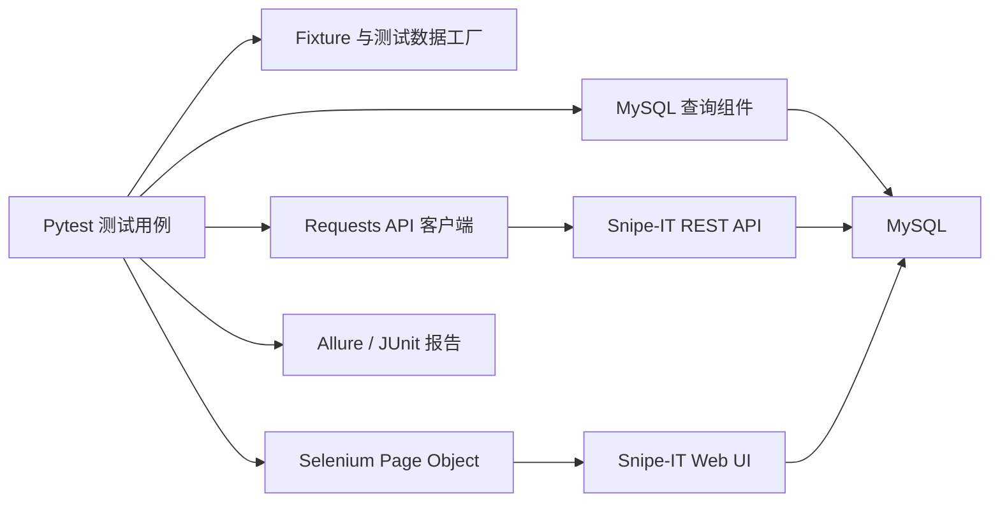

# Snipe-IT 企业资产管理自动化测试项目

基于 Python、Pytest、Requests 和 Selenium 构建的企业 IT 资产管理自动化测试项目，以开源资产管理系统 [Snipe-IT](https://snipeitapp.com/) 为真实测试对象，覆盖 REST API、Web UI、MySQL 数据一致性以及资产领用、归还业务闭环。

项目地址：[https://github.com/Anemone-2/Test-Automation-Framework](https://github.com/Anemone-2/Test-Automation-Framework)

## 项目简介

本项目围绕企业内部“员工—资产—领用—归还”的业务关系展开，不依赖简单的演示接口。被测系统通过 Docker Compose 独立部署，自动化测试通过 API 动态创建员工、分类、厂商、位置、型号和硬件资产，再从接口、数据库和 Web 页面三个层面验证业务结果。

当前主要实现：

- Snipe-IT API Token 鉴权测试
- 员工创建、查询、修改、删除及异常校验
- 资产基础数据和硬件资产 CRUD 测试
- 资产领用、归还、操作历史及异常场景测试
- API 响应与 MySQL 数据一致性校验
- Selenium Page Object Web 自动化
- API 创建数据后通过 Web 列表和详情交叉验证
- Allure 中文测试步骤、请求响应附件和失败截图
- 测试数据动态生成、反向清理和异常兜底清理
- Token、密码等敏感信息自动脱敏

## 技术栈

| 分类 | 技术 |
| --- | --- |
| 编程语言 | Python 3.12+ |
| 测试框架 | Pytest |
| 接口自动化 | Requests、Snipe-IT REST API |
| Web 自动化 | Selenium、Page Object Model |
| 数据库校验 | MySQL、MySQL Connector/Python |
| 环境部署 | Docker Compose |
| 测试报告 | Allure、JUnit XML |
| 配置管理 | `.env`、Python Dataclass |
| 版本管理 | Git |

## 测试架构



框架的主要分层：

- 配置层：从本地 `.env` 加载地址、账号、Token、浏览器和数据库配置。
- 客户端层：统一处理 API 地址、请求头、超时、HTTP 429 重试和报告附件。
- 页面层：封装登录、用户列表、用户详情、资产列表和资产详情页面。
- 数据层：查询 MySQL 中的资产状态、分配关系和审计日志。
- 用例层：组织鉴权、员工、资产、领用归还和 API/Web 组合场景。
- 报告层：输出 Allure、JUnit XML，失败时附加截图和页面源码。

## 当前测试覆盖

| 模块 | 逻辑场景 | 实际执行数 | 主要内容 |
| --- | ---: | ---: | --- |
| API 鉴权 | 3 | 3 | 有效、缺失、无效 Token |
| 员工管理 | 7 | 9 | CRUD、必填字段、重复用户名、业务错误 |
| 资产管理 | 10 | 12 | 基础数据、CRUD、重复标签、组合查询、异常关联 |
| 领用归还 | 10 | 10 | 领用、归还、异常状态、历史记录、数据库审计 |
| Web 自动化 | 4 | 4 | 登录、员工详情、资产详情、领用归还闭环 |
| **合计** | **34** | **38** | **API、Web、数据库联合验证** |

最近一次本地完整回归结果：

```text
38 passed in 36.13s
测试数据残留：0
报告敏感信息命中：0
```

> 执行时间取决于机器性能、容器状态和浏览器驱动版本，以上数据仅为当前环境的一次实测结果。

## 核心业务闭环

`WEB-004` 覆盖了目前最完整的跨层业务场景：

1. 通过 API 创建员工、资产及相关基础数据。
2. 通过 API 将可领用资产分配给员工。
3. 查询 MySQL，校验 `assigned_to` 和 `assigned_type`。
4. 登录 Web，在资产详情中校验领用员工和“归还”入口。
5. 通过 API 归还资产。
6. 校验 API 和 MySQL 中的分配关系已经清空。
7. 刷新 Web 详情，校验资产重新出现“领用”入口。
8. 测试结束后自动删除员工、资产及依赖数据。

## 目录结构

```text
Test-Automation-Framework-main/
├─ base/
│  └─ snipeit_client.py             # Snipe-IT REST API 客户端
├─ common/
│  ├─ sensitive_data.py             # 敏感字段递归脱敏
│  └─ snipeit_database.py           # MySQL 查询封装
├─ conf/
│  └─ snipeit_settings.py           # 环境和浏览器配置
├─ infra/snipeit/
│  ├─ docker-compose.yml            # Snipe-IT + MySQL
│  ├─ .env.example                  # 本地配置模板
│  └─ README.md                     # Docker 环境补充说明
├─ pages/
│  ├─ base_page.py                  # Page Object 基类
│  ├─ login_page.py                 # 登录页面
│  ├─ assets_page.py                # 资产列表页面
│  ├─ asset_details_page.py         # 资产详情页面
│  ├─ users_page.py                 # 用户列表页面
│  └─ user_details_page.py          # 用户详情页面
├─ testcase/snipeit/
│  ├─ conftest.py                   # 公共 Fixture、数据工厂和清理机制
│  ├─ helpers.py                    # 测试数据辅助方法
│  ├─ api/                          # API 与数据库测试
│  └─ web/                          # Selenium Web 测试
├─ scripts/
│  ├─ snipeit_ci_start.ps1          # CI 环境启动和健康检查
│  └─ snipeit_ci_stop.ps1           # CI 环境安全停止
├─ report/                          # 本地 Allure/JUnit 输出，默认不提交
├─ Jenkinsfile                      # Snipe-IT Jenkins Pipeline
├─ pyproject.toml                   # Python 项目和依赖配置
└─ pytest.ini                       # Pytest 配置和 Marker
```

## 环境要求

- Windows 10/11
- Python 3.12 或更高版本
- Docker Desktop
- Microsoft Edge 或 Google Chrome
- Java 17+ 和 Allure Commandline（查看 Allure 报告时需要）
- Git

Selenium 默认使用 Edge，并支持切换到 Chrome。首次运行时，Selenium Manager 可能需要下载匹配的浏览器驱动。

## 首次配置

### 1. 创建 Python 虚拟环境

在项目根目录打开 PowerShell：

```powershell
python -m venv .venv
.\.venv\Scripts\Activate.ps1
python -m pip install --upgrade pip
python -m pip install -e .
```

### 2. 创建本地环境配置

```powershell
Copy-Item .\infra\snipeit\.env.example .\infra\snipeit\.env
notepad .\infra\snipeit\.env
```

至少需要替换以下占位值：

- `APP_KEY`
- `DB_PASSWORD`
- `MYSQL_ROOT_PASSWORD`
- `SNIPEIT_ADMIN_PASSWORD`
- `SNIPEIT_API_TOKEN`

可以在 PowerShell 中生成符合 Laravel 要求的随机 `APP_KEY`：

```powershell
$keyBytes = New-Object byte[] 32
$keyGenerator = [System.Security.Cryptography.RandomNumberGenerator]::Create()
$keyGenerator.GetBytes($keyBytes)
"base64:$([Convert]::ToBase64String($keyBytes))"
$keyGenerator.Dispose()
```

将输出结果完整填写到 `.env` 的 `APP_KEY` 中。

> `infra/snipeit/.env` 已被 Git 忽略。不要提交管理员密码、数据库密码、API Token 或真实业务数据。

### 3. 启动 Snipe-IT 和 MySQL

```powershell
docker compose --env-file .\infra\snipeit\.env -f .\infra\snipeit\docker-compose.yml up -d
docker compose --env-file .\infra\snipeit\.env -f .\infra\snipeit\docker-compose.yml ps
```

服务地址：

| 服务 | 地址 |
| --- | --- |
| Snipe-IT | `http://localhost:8090` |
| MySQL | `127.0.0.1:13307` |

首次启动后，访问 `http://localhost:8090` 完成 Snipe-IT 初始化向导，并创建自动化管理员账号。

### 4. 创建 API Token

使用管理员账号登录 Snipe-IT：

1. 打开个人账号设置。
2. 进入“管理 API 密钥”。
3. 创建 Personal Access Token。
4. 将 Token 写入 `.env` 的 `SNIPEIT_API_TOKEN`。
5. 确认 `.env` 中的管理员用户名和密码与初始化账号一致。

如果需要中文界面，将管理员语言设置为 `zh-CN`。

## 执行测试

### 完整回归

```powershell
.\.venv\Scripts\python.exe -m pytest .\testcase\snipeit -q
```

### 只运行 API 测试

```powershell
.\.venv\Scripts\python.exe -m pytest .\testcase\snipeit -m "snipeit and api" -q
```

### 只运行 Web 测试

```powershell
.\.venv\Scripts\python.exe -m pytest .\testcase\snipeit -m "snipeit and web" -q
```

### 运行核心冒烟场景

```powershell
.\.venv\Scripts\python.exe -m pytest .\testcase\snipeit -m "snipeit and smoke" -q
```

### 同时生成 Allure 和 JUnit XML

```powershell
.\.venv\Scripts\python.exe -m pytest .\testcase\snipeit -q `
  --alluredir=.\report\temp-snipeit-all `
  --clean-alluredir `
  --junitxml=.\report\snipeit-junit.xml
```

## 查看 Allure 报告

```powershell
allure serve .\report\temp-snipeit-all
```

报告中可以查看：

- 中文业务模块和用例标题
- 每个业务步骤的执行结果
- API 请求地址、参数和脱敏后的请求头
- API 响应内容
- 测试数据创建及清理结果
- Web 失败截图和页面源码
- 用例耗时、分类和失败堆栈

`allure serve` 仅用于本地预览，关闭对应终端后报告地址会失效。

## 浏览器配置

在 `infra/snipeit/.env` 中修改：

```dotenv
SNIPEIT_BROWSER=edge
SNIPEIT_HEADLESS=true
SNIPEIT_UI_TIMEOUT=10
```

支持：

- `SNIPEIT_BROWSER=edge`
- `SNIPEIT_BROWSER=chrome`
- `SNIPEIT_HEADLESS=true`：无界面运行，适合回归和 CI
- `SNIPEIT_HEADLESS=false`：显示浏览器，适合本地调试

如果不使用 Selenium Manager，可以通过 `SNIPEIT_DRIVER_PATH` 指定本地驱动路径。

## 测试数据与安全设计

- 所有自动化数据使用 `autotest_` 前缀和随机 UUID，避免与已有数据冲突。
- 资源工厂按照依赖关系反向删除资产、型号、位置、厂商、分类和员工。
- 资产处于领用状态时，清理流程会先自动归还，再删除依赖数据。
- API 请求和响应进入 Allure 前会递归脱敏 Token、密码和 Cookie。
- 配置类的密码和 Token 字段不会显示在对象日志中。
- `.env`、报告临时文件和本地数据库数据不应提交到 Git。

## 停止环境

```powershell
docker compose --env-file .\infra\snipeit\.env -f .\infra\snipeit\docker-compose.yml down
```

日常停止环境不要添加 `-v`。`down -v` 会删除 MySQL 和 Snipe-IT 持久化卷中的数据。

## 持续集成状态

项目已经提供 Snipe-IT 专用 `Jenkinsfile`，流水线可以完成：

1. 拉取代码并创建或复用 Jenkins Python 虚拟环境。
2. 从 Jenkins Secret file Credential 注入 Snipe-IT `.env`。
3. 启动 Snipe-IT 和 MySQL，并等待数据库健康及 Web 服务可访问。
4. 按构建参数执行全量、冒烟、API 或 Web 测试。
5. 发布 JUnit XML、Allure 报告并归档构建产物。
6. 无论测试成功或失败都执行环境收尾。
7. 如果容器在构建前已经运行，流水线会复用并保留它们；如果由本次构建启动，则构建后自动停止。

### Jenkins 插件和工具

确认 Jenkins 已安装：

- Pipeline
- Git
- Credentials Binding
- JUnit
- Allure Jenkins Plugin

在“全局工具配置”中配置：

- JDK 名称：`JDK21`
- Allure Commandline

### 配置 Snipe-IT Secret file

1. 在本地确认 `infra/snipeit/.env` 可以运行当前38条测试。
2. 进入“管理 Jenkins → Credentials → System → Global credentials”。
3. 新建凭据，类型选择“Secret file”。
4. 上传本地 `infra/snipeit/.env`。
5. 凭据 ID 设置为 `snipeit-env-file`。

流水线只读取该临时文件，不会将密码、Token 或 `APP_KEY` 复制到Git工作区。

### 创建 Pipeline 任务

1. 新建一个 Pipeline 任务。
2. Definition 选择“Pipeline script from SCM”。
3. SCM 选择 Git，并填写本项目仓库地址。
4. Script Path 填写 `Jenkinsfile`。
5. 保存后先执行一次构建，使参数出现在“Build with Parameters”页面。

可用参数：

| 参数 | 默认值 | 说明 |
| --- | --- | --- |
| `SNIPEIT_ENV_CREDENTIAL_ID` | `snipeit-env-file` | Secret file凭据ID |
| `PYTHON_BOOTSTRAP` | `D:/python/python.exe` | Jenkins机器上的Python路径 |
| `TEST_SCOPE` | `all` | `all`、`smoke`、`api`或`web` |
| `BROWSER` | `edge` | `edge`或`chrome` |
| `HEADLESS` | `true` | 是否无界面运行Web测试 |

### 首次运行限制

当前流水线能够自动启动容器，但Snipe-IT数据库卷必须已经完成一次初始化，并包含管理员账号、API Token和必要状态标签。全新的Jenkins机器需要先按照“首次配置”章节完成一次初始化。

后续计划继续实现全新环境下的管理员和API Token自动引导，使流水线不依赖预初始化的Docker Volume。

如果在本地手工验证CI脚本时遇到“running scripts is disabled”提示，可以使用一次性的执行策略绕过；该命令不会修改系统级PowerShell策略：

```powershell
powershell.exe -NoProfile -ExecutionPolicy Bypass -File `
  .\scripts\snipeit_ci_start.ps1 -EnvFile .\infra\snipeit\.env
```

## 仓库范围

仓库已完成历史通用框架清理，仅保留当前 Snipe-IT 项目所需的 API、Web UI、MySQL、Docker、Allure 和 Jenkins 代码。当前测试入口为 `testcase/snipeit`。

## License

本项目代码遵循仓库中的 [LICENSE](./LICENSE)。Snipe-IT 本身遵循其官方开源许可证，本仓库不包含 Snipe-IT 源代码。
